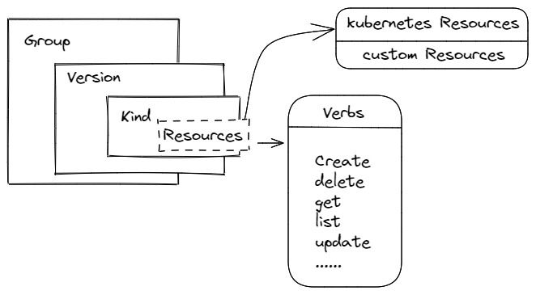

### **前置**

#### **资源概念：**

官方地址：[https://kubernetes.io/docs/reference/generated/kubernetes-api/v1.31/#api-groups](https://)

- **Group : 资源分组**
  
  - **有组名**
    
    #### **`apps` 组**
    - **Deployment**：定义应用的声明式更新。
    - **ReplicaSet**：维持某一组 Pod 的副本数量。
    - **StatefulSet**：用于有状态应用的部署和管理。
    - **DaemonSet**：确保每个节点运行一个特定的 Pod。
    - **ControllerRevision**：用于跟踪控制器修订的历史。
    
    #### **`batch` 组**
    - **Job**：管理一次性任务的运行。
    - **CronJob**：用于调度周期性任务。
    
    #### **`autoscaling` 组**
    - **HorizontalPodAutoscaler**：自动伸缩 Pod 的数量。
    - **VerticalPodAutoscaler**：调整 Pod 中容器的资源请求和限制（在某些扩展中）。
    
    #### **`networking.k8s.io` 组**
    - **Ingress**：定义集群外部流量如何访问服务。
    - **NetworkPolicy**：定义网络流量的控制策略。
    
    #### **`rbac.authorization.k8s.io` 组**
    - **Role**：定义在特定命名空间内的访问权限。
    - **ClusterRole**：定义集群范围内的访问权限。
    - **RoleBinding**：将 Role 绑定到用户或服务账号。
    - **ClusterRoleBinding**：将 ClusterRole 绑定到用户或服务账号。
    
    #### **`policy` 组**
    - **PodSecurityPolicy**：控制 Pod 能使用的安全选项（已被弃用）。
    
    #### **`apiextensions.k8s.io` 组**
    - **CustomResourceDefinition (CRD)**：定义自定义资源，扩展 Kubernetes API。
    
    #### **`storage.k8s.io` 组**
    - **StorageClass**：定义持久存储的存储类。
    - **VolumeAttachment**：处理外部存储卷与节点的附加。
    
    #### **`admissionregistration.k8s.io` 组**
    - **MutatingWebhookConfiguration**：定义可变的准入控制 Webhook。
    - **ValidatingWebhookConfiguration**：定义验证准入控制 Webhook。
    
    #### **`certificates.k8s.io` 组**
    - **CertificateSigningRequest**：用于请求 TLS 证书的签名。
    
    #### **`coordination.k8s.io` 组**
    - **Lease**：为高可用性组件提供心跳机制。
    
    #### **`discovery.k8s.io` 组**
    - **EndpointSlice**：提供更高效的服务端点管理和服务发现。
    
    #### **`node.k8s.io` 组**
    - **RuntimeClass**：用于选择不同的容器运行时。
    
    #### **`scheduling.k8s.io` 组**
    - **PriorityClass**：定义调度的优先级。
    
    #### **`flowcontrol.apiserver.k8s.io` 组**
    - **FlowSchema**：定义 API 请求的流量控制规则。
    - **PriorityLevelConfiguration**：定义不同优先级的流量控制配置。
  - **无组名（core groups，核心资源组）,Kubernetes 的核心 API 资源，属于 `core/v1` 版本，无需显式指定组名。**
    
    - **Pod**：管理容器的最小单位。
    - **Service**：管理 Pod 的网络服务。
    - **Node**：集群中的节点信息。
    - **ConfigMap**：用于存储非敏感的配置信息。
    - **Secret**：用于存储敏感数据（如密码、密钥等）。
    - **Namespace**：隔离和组织资源的逻辑分组。
    - **ReplicationController**：管理 Pod 副本。
    - **PersistentVolume (PV)**：用于声明集群中的持久存储资源。
    - **PersistentVolumeClaim (PVC)**：用于请求持久存储资源。
    - **Event**：记录集群事件。
    - **LimitRange**：限制某个命名空间内的资源使用范围。
    - **ResourceQuota**：限制某个命名空间内的资源使用配额。
  
- **Version**
  
  - Alpha：内部测试版本，如 v1alpha1
  - Beta：经历了官方和社区测试的相对稳定版，如 v1beta1
  - Stable：正式发布版，如 v1、v2
  
- **Kind : 标识资源类型的字段。每个 Kubernetes 资源对象都有一个 `kind` 字段，用于指明该对象的类型。**

  - **Pod**：最小的部署单位，包含一个或多个容器。
  - **Service**：定义如何访问 Pod 的网络服务。
  - **Deployment**：用于管理 Pod 的副本和更新。
  - **StatefulSet**：用于管理有状态应用程序的 Pod。
  - **DaemonSet**：确保在每个节点上运行一个特定的 Pod。
  - **Job**：管理一次性任务的执行。
  - **CronJob**：用于定期运行的 Job。
  - **ConfigMap**：用于存储非敏感的配置信息。
  - **Secret**：用于存储敏感数据，如密码和令牌。
  - **Ingress**：管理集群外部流量如何路由到服务。
  
- **Resource**

  在 Kubernetes 中，资源指的是可以被管理的对象或实体，如 Pod、Service、Deployment 等。资源是 Kubernetes API 中的实际对象，用于支持应用程序的运行和管理。

  资源可以包含多个属性，如 `apiVersion`、`kind`、`metadata`、`spec` 和 `status`。

  **Resource** 是 Kubernetes 中可以管理的对象，包括其所有属性。

  **Kind** 是用来标识 Resource 类型的字段，指明具体的资源类型（如 Pod、Service 等）

  Kind 就是我们的资源种类，如 Pod、Deployment 等，Resource 是 Kind 资源种类的资源子类，如：pods、services、deployments

#### **GVK && GVR**

GVR` 与 `GVK` 通过REST映射可进行转化。

使用客户端工具如 `kubectl`、`clientSet`、`curl` 时，首先会根据 `GVR` 生成请求，然后 `Kubernetes API Server` 会查询 `HTTP PATH` 对应的 `Resource` 是否支持，并与 `ETCD` 进行交互。

当 `API Server` 不支持该 `Resource` 时，`Kubernetes` 会报错**the server doesn’t have a resource type “…”**，使用 `kubectl api-resources` 命令可查看支持的 `Resource`。

- GVK : group、verison、kind

  - `GVK` 与存储在 `ETCD` 中的 `Object` 类型对应。

- GVR : group、version、resource

  - 与 `HTTP` 请求里的 `PATH` 对应，查询Pod的请求`GET /api/v1/namespaces/{namespace}/pods`就是一个 `GVR`。

  > 

#### Clinet-Go

- cache
- informer

#### **Schema**

源码包地址： https://github.com/kubernetes/apimachinery/blob/master/pkg/runtime/scheme.go

schema 即 k8s 集群资源的规范定义和元数据的集合

`apimachinery` 包则是 schema 的实现， schema 就是 **GVK** 的属性约束 与 **GVR** 之间的映射。

```
网上资料：
简单来说，Schema 可以被理解为一种定义和约束集群资源结构的标准方式。通过使用 Schema，Kubernetes 可以确保集群中的各种资源具有一致的结构和属性，从而方便了资源的创建、修改和查询等操作。

在 Kubernetes 中，每个资源都由一个特定的 API 版本和 Kind 来标识，这些信息就构成了资源的 Schema。例如，一个 Deployment 资源在 v1 API 版本中的 Schema 包括其特有的字段和属性，如 replicas、selector 等。通过这个 Schema，Kubernetes 可以在创建或更新资源时验证其结构的正确性，并确保其符合预期的规范。

此外，Schema 还提供了对资源的元数据描述，包括其名称、命名空间、标签等。这些元数据信息对于集群的管理和查询操作至关重要。例如，通过标签选择器（label selector），我们可以方便地查询具有特定标签的资源；通过命名空间（namespace），我们可以对资源进行隔离和分组，实现多租户的部署和管理。

Kubernetes 的 API Schema 还具有灵活性和可扩展性。随着 Kubernetes 的不断发展，新的资源和 API 版本不断涌现，Schema 的定义也需要随之更新和扩展。Kubernetes 通过版本控制和自定义资源定义（Custom Resource Definition，简称 CRD）等方式，支持用户自定义资源和 API，使得集群的扩展性和适应性得到了极大的提高。

综上所述，Kubernetes 的 API Schema 是集群管理和操作的核心组件之一。
```

扩展一个资源的整个流为：

- 资源类型在：`k8s.io/api/{Group}/types.go`
- 资料类型的实现接口`k8s.io/apimachinery/pkg/runtime/interfaces.go.Object`
- 其中是基于`Deployment` 的类型，`metav1.TypeMeta` 和`metav1.ObjectMeta`
- `metav1.TypeMeta` 实现了`GetObjectKind()` ；`metav1.ObjectMeta` 实现了`DeepCopyinfo=()`，`DeepCopy()` ，还需要实现`DeepCopyObject()`
- 最后注册资源到 schema 中`k8s.io/api/apps/v1/register.go`

### controller-runtime 
